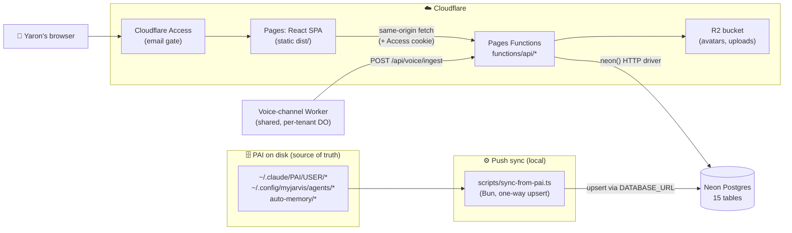
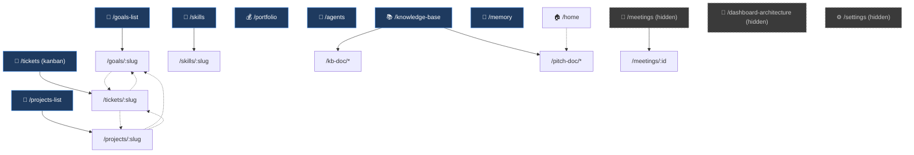
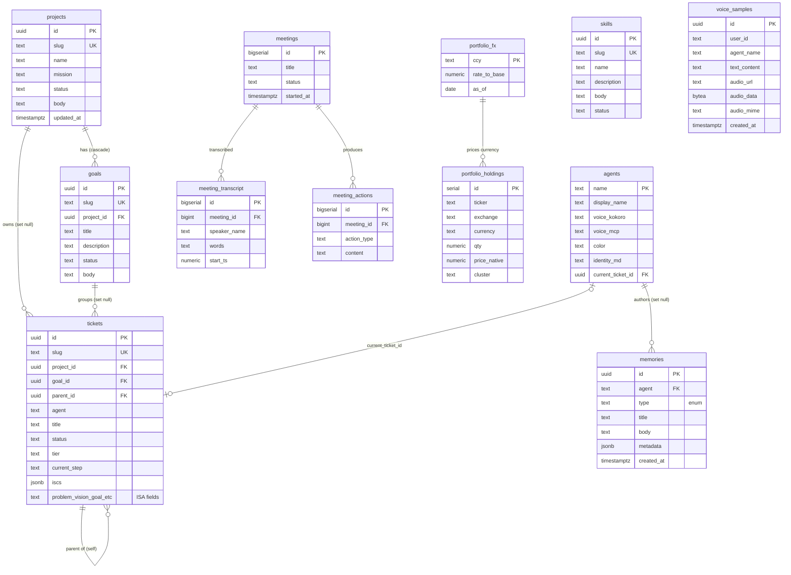
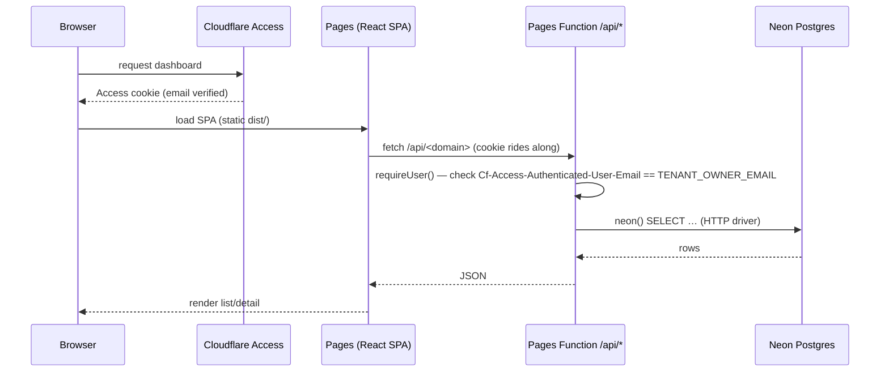
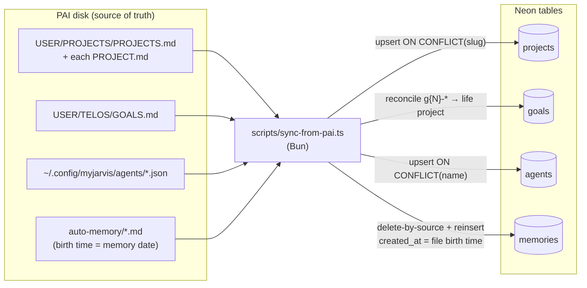
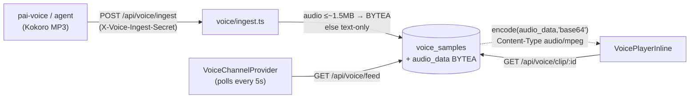
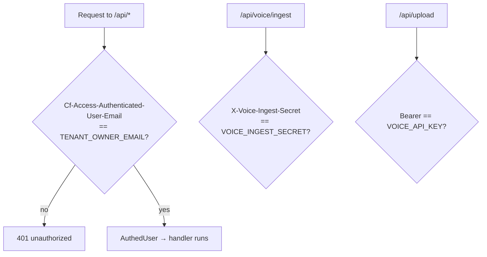
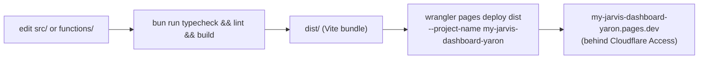

# MyJarvis Dashboard — Architecture

> How the dashboard is wired: every page, the full database, and how data flows from
> Yaron's PAI files on disk all the way to the screen. Companion to `docs/stack-notes.md`
> (infra setup) and the repo `CLAUDE.md` (template/provisioning rules).
>
> Last mapped: 2026-06-01. Diagrams are Mermaid — they render in GitHub and most Markdown viewers.

---

## 1. System at a glance

A **single-tenant** web dashboard that visualises Yaron's PAI life-operating-system data
(projects, goals, agents, memories, portfolio, …). It is a fork of the multi-tenant
MyJarvis template, deployed to **Cloudflare Pages**, reading from **Neon Postgres**, gated
by **Cloudflare Access**.

**Founding constraint:** Neon is a **disposable projection of disk**. The PAI files are the
source of truth; the sync tool pushes one-way into Neon; the dashboard only ever *reads*
Neon. Nothing is authored in the browser and written back to disk.

---

## 2. Tech stack

| Layer | Technology |
|---|---|
| Frontend | React 19 + Vite 7 + TypeScript, Tailwind v4, shadcn/ui, lucide icons, react-router |
| Data fetching | Thin `useApi()` fetch wrapper (`src/lib/api.ts`); pages hold state with `useState`/`useEffect`. `@tanstack/react-query` present but not the primary pattern. Voice feed polls every 5s. |
| Backend | Cloudflare **Pages Functions** (file-routed under `functions/api/`) |
| Database | **Neon Postgres 17** (HTTP serverless driver, pooled endpoint) |
| Auth | **Cloudflare Access** (email gate) + per-handler owner check; WorkOS AuthKit client present from template |
| Storage | Neon (incl. voice audio as `BYTEA`) + **R2** (avatars, uploaded assets) |
| Voice | Shared `my-jarvis-voice-channel` Worker (per-tenant Durable Object), Kokoro-rendered MP3 |
| Deploy | `bun run build` → `wrangler pages deploy dist` (project `my-jarvis-dashboard-yaron`) |

---

## 3. Pages & navigation

The sidebar exposes **9 primary destinations**; several detail and document routes are
reachable by navigation but hidden from the sidebar.

### Route → component → API map

| Route | Component | API endpoint(s) | Related | Sidebar |
|---|---|---|---|---|
| `/` → `/home` | `HomePage.tsx` | — | pitch decks | **Home** |
| `/goals-list` | `GoalsListPage.tsx` | `GET /api/goals` | `/goals/:slug` | **Goals** |
| `/goals/:slug` | `GoalDetailPage.tsx` | `GET /api/goals/:slug` | projects, tickets | — |
| `/projects-list` | `ProjectsListPage.tsx` | `GET /api/projects` | `/projects/:slug` | **Projects** |
| `/projects/:slug` | `ProjectDetailPage.tsx` | `GET /api/projects/:slug` | goals, tickets | — |
| `/portfolio` | `PortfolioPage.tsx` | `GET /api/portfolio` | — | **Portfolio** |
| `/tickets` | `TicketsKanbanPage.tsx` | `GET /api/tickets`, `PUT /api/tickets/:slug` | `/tickets/:slug` | **Tickets** |
| `/tickets/:slug` | `TicketDetailPage.tsx` | `GET/PATCH/PUT/DELETE /api/tickets/:slug` | projects, goals | — |
| `/agents` | `AgentsPage.tsx` | `GET /api/agents` | — | **Agents** |
| `/skills` | `SkillsPage.tsx` | `GET /api/skills` | `/skills/:slug` | **Skills** |
| `/skills/:slug` | `SkillDetailPage.tsx` | `GET/PUT /api/skills/:slug` | `/skills` | — |
| `/memory` | `MemoryPage.tsx` | `GET /api/memories` | — | **Memory** |
| `/knowledge-base` | `KnowledgeBaseListPage.tsx` | `GET /api/kb` | kb/pitch docs | **Knowledge Base** |
| `/kb-doc/*` | `KbBlueprintPage.tsx` | `GET /api/kb/:slug` | KB | — |
| `/pitch-doc/*` | `PitchDocBlueprintPage.tsx` | `GET /api/kb/:slug` | KB | — |
| `/dashboard-architecture` | `DashboardArchitecturePage.tsx` | `GET /api/kb/...` | — | hidden |
| `/meetings` | `MeetingsPage.tsx` | `/api/meetings`, `/api/calendar` | `/meetings/:id` | hidden (opt-in) |
| `/meetings/:id` | `MeetingDetailPage.tsx` | `GET/POST /api/meetings/:id` | `/meetings` | — |
| `/settings` | `SettingsPage.tsx` | `GET/PATCH /api/settings` | — | hidden |

**Pattern:** each domain follows **list → detail**. The list page calls the collection
endpoint (`/api/<domain>`); the detail page calls the item endpoint (`/api/<domain>/:slug`)
which returns the row plus its related children (a project detail bundles its goals and
tickets, a goal detail bundles its tickets).

---

## 4. API layer

All endpoints are Cloudflare Pages Functions under `functions/api/`, file-routed. Every
handler calls `requireUser()` first, then `getDb(env)` for a Neon connection.

| Endpoint | Methods | Reads / writes |
|---|---|---|
| `/api/projects` · `/api/projects/[slug]` | GET | projects (+ child goals/tickets on detail) |
| `/api/goals` · `/api/goals/[slug]` | GET | goals (+ child tickets on detail) |
| `/api/tickets` · `/api/tickets/[slug]` | GET, POST, PUT, PATCH, DELETE | tickets (kanban writes status here) |
| `/api/agents` | GET | agents (LEFT JOIN tickets for current/in-flight) |
| `/api/memories` | GET | memories (ordered `created_at DESC`) |
| `/api/skills` · `/api/skills/[slug]` | GET, PUT | skills (detail editable) |
| `/api/portfolio` | GET | portfolio snapshot (see §6 note) |
| `/api/kb` · `/api/kb/[[catchall]]` | GET | page_content (KB + pitch docs) |
| `/api/meetings` · `/api/meetings/[id]` | GET, POST | meetings, meeting_transcript, meeting_actions |
| `/api/calendar` · `/calendar/events` · `/calendar/disconnect` | GET, POST | calendar connection |
| `/api/voice/ingest` | POST | inserts voice_samples (secret-gated, see §7) |
| `/api/voice/feed` | GET | lists voice_samples (newest 200) |
| `/api/voice/clip/[id]` | GET | streams `audio_data` BYTEA as MP3 |
| `/api/settings` | GET, PATCH | user_settings JSONB blob |
| `/api/mcp-activity` | GET, POST | mcp_activity audit feed |
| `/api/sessions` | GET, POST | session registry |
| `/api/upload` | POST | writes asset to R2 (Bearer-gated) |
| `/api/version` | — | build version string |

---

## 5. Database

15 tables across five concerns: **brain** (projects/goals/tickets/agents/memories),
**skills**, **meetings**, **portfolio**, and **platform** (settings/voice/KB/mcp-activity).

### Entity-relationship diagram

> Not drawn (no FKs — standalone tables): **user_settings** (`user_id` PK, JSONB blob),
> **page_content** (`page_slug` UK, JSONB — KB & pitch docs), **mcp_activity** (audit log).

### Foreign-key cheatsheet

| Child | Column | → Parent | On delete |
|---|---|---|---|
| goals | project_id | projects.id | **cascade** |
| tickets | project_id | projects.id | set null |
| tickets | goal_id | goals.id | set null |
| tickets | parent_id | tickets.id | set null (self-ref) |
| agents | current_ticket_id | tickets.id | set null |
| memories | agent | agents.name | set null |
| meeting_transcript | meeting_id | meetings.id | **cascade** |
| meeting_actions | meeting_id | meetings.id | **cascade** |

`tickets.agent` is a plain `text` mirror of `agents.name` (no enforced FK) — the assignment
link the kanban uses; `agents.current_ticket_id` is the reverse "what is this agent on now."

### Schema migration order

`001_init` (platform) → `002_meetings` → `008_dashboard_brain` (the 5 brain tables) →
`009_skills` → `010_mcp_activity` → `011_projects_body` (`projects.body`) →
`012_drift_fix` (`goals.body`, `tickets.tier`) → `013_portfolio` → `014_voice_audio`
(`voice_samples.audio_data/_mime`) → `099_seed`.

---

## 6. Data-flow: the read path

How a page renders, end to end:

> **Current-state note — Portfolio:** `portfolio_holdings`/`portfolio_fx` tables exist
> (`013_portfolio`), but `/api/portfolio` currently serves a **hardcoded `SEED[]` array
> embedded in the function**, not a `SELECT`. Swapping to the table is a known TODO. Every
> other domain reads its table live.

---

## 7. Data-flow: PAI → Neon sync

The push-side ingestion that keeps the dashboard current with disk (built 2026-06-01).

- **Credential:** `DATABASE_URL` from env or gitignored `.dev.vars` (same string as the
  wrangler secret). **Model:** one-way, idempotent, non-destructive to dashboard-native rows
  (`life`, `update-telos`). **Run:** `bun scripts/sync-from-pai.ts [--dry-run]`.
- **Not yet synced:** tickets (no PAI source — dashboard-native), skills, portfolio.
- **Not yet scheduled:** runs manually; next step is a launchd timer.

---

## 8. Data-flow: voice

Voice **audio bytes live in Neon** (`voice_samples.audio_data BYTEA`), served via
`/api/voice/clip/:id`. R2 holds avatars and uploaded assets only. The frontend polls
`/api/voice/feed` every 5 seconds and plays new clips inline.

---

## 9. Auth & security model

- **Boundary:** Cloudflare Access verifies identity and sets `Cf-Access-Authenticated-User-Email`.
  `requireUser()` trusts that header and matches it against `TENANT_OWNER_EMAIL`
  (`aitheroad@gmail.com`). Browser fetches are same-origin, so the Access cookie rides along —
  no Bearer token in the SPA.
- **Machine endpoints:** `/api/voice/ingest` and `/api/upload` are gated by shared secrets
  (`VOICE_INGEST_SECRET`, `VOICE_API_KEY`) instead of Access, since they're called by Workers.
- **⚠️ Known hardening gap:** handlers trust the Access header without verifying the
  `Cf-Access-Jwt-Assertion` JWT signature against the team's JWKS. If a request reached a
  Function bypassing Access (misconfig), the header could be spoofed. Verifying the JWT is the
  documented next hardening step.

### Secrets & vars

| Name | Type | Purpose |
|---|---|---|
| `TENANT_OWNER_EMAIL` | public var | single-tenant allow-list |
| `DATABASE_URL` | secret | Neon pooled connection |
| `VOICE_INGEST_SECRET` | secret | voice ingest auth |
| `VOICE_API_KEY` | secret | upload endpoint auth |
| `VOICE_BUCKET` / `VOICE_PUBLIC_URL` | R2 binding / var | avatars + assets |
| `WORKOS_CLIENT_SECRET` | secret | WorkOS (template carry-over) |

---

## 10. Deployment

Pre-push gate: `typecheck && lint && build` (a failed deploy = user-facing outage). Data
changes (the PAI sync) need **no** redeploy — Functions read Neon at request time.

---

## 11. Current state (what's live vs placeholder)

| Domain | Source | Status |
|---|---|---|
| Projects / Goals / Agents / Memories | PAI disk → Neon (sync tool) | ✅ **live**, fresh per sync |
| Tickets | dashboard-native (Neon) | ✅ live; 1 seeded ticket; no PAI source yet |
| Skills | Neon (template seed) | seeded; not yet synced from `~/.claude/skills/` |
| Portfolio | hardcoded `SEED[]` in function | ⚠️ table exists but unused; swap to `SELECT` is TODO |
| Knowledge Base / pitch docs | Neon `page_content` | seeded |
| Voice feed | Neon `voice_samples` | wired; populates as agents ingest |
| Meetings | Neon (`meetings*`) | feature present, sidebar entry off |

---

*Maintenance: regenerate this map when routes, tables, or the sync sources change. The
authoritative sources are `src/components/atomic-crm/root/CRM.tsx` (routes), the `sql/*.sql`
migrations (schema), and `functions/api/**` (endpoints).*
