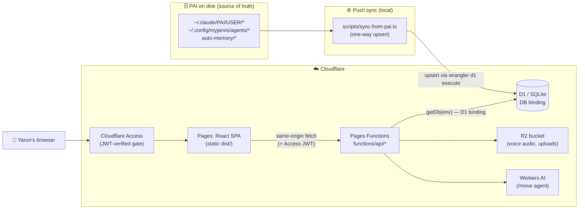
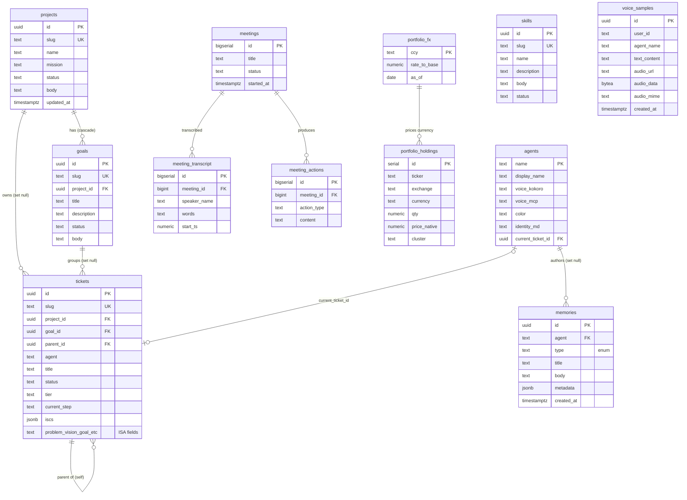
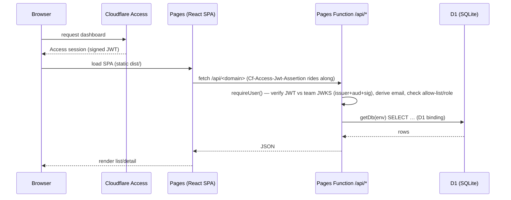
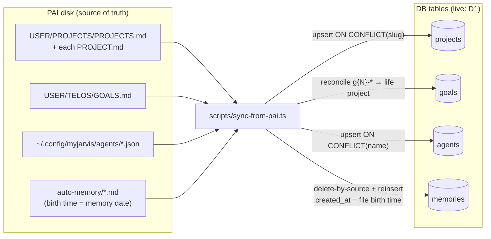
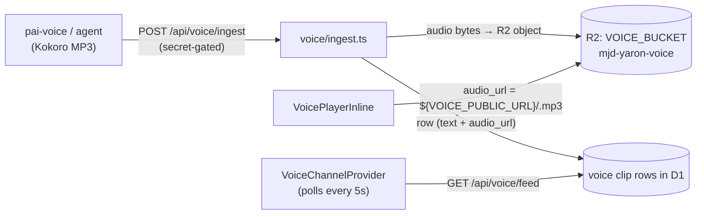
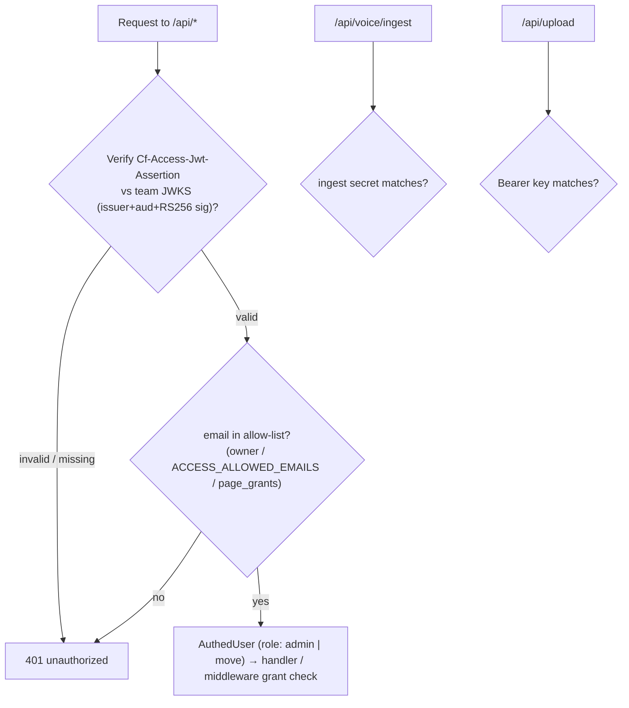
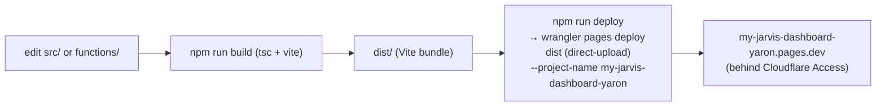

# MyJarvis Dashboard — Architecture

> How the dashboard is wired: every page, the full database, and how data flows from
> Yaron's PAI files on disk all the way to the screen. Companion to `docs/stack-notes.md`
> (infra setup) and the repo `CLAUDE.md` (template/provisioning rules).
>
> Last mapped: 2026-06-24 (updated for D1 migration + CF Access). Diagrams are Mermaid — they render in GitHub and most Markdown viewers.

---

## 1. System at a glance

A **single-tenant** web dashboard that visualises Yaron's PAI life-operating-system data
(projects, goals, agents, memories, portfolio, …). Originally forked from the multi-tenant
MyJarvis template, now long diverged. Deployed to **Cloudflare Pages**, reading from
**Cloudflare D1 (SQLite)**, gated by **Cloudflare Access**.

**Founding constraint:** the database is a **disposable projection of disk**. The PAI files
are the source of truth; the sync tool pushes one-way into the store; the dashboard only ever
*reads* it. Nothing is authored in the browser and written back to disk.

---

## 2. Tech stack

| Layer | Technology |
|---|---|
| Frontend | React 19 + Vite 7 + TypeScript, Tailwind v4, `@radix-ui` primitives (no `shadcn` dependency), lucide icons, react-router 7 |
| Data fetching | Thin `useApi()` fetch wrapper (`src/lib/api.ts`); pages hold state with `useState`/`useEffect`. `@tanstack/react-query` present but not the primary pattern. Voice feed polls every 5s. |
| Backend | Cloudflare **Pages Functions** (file-routed under `functions/api/`) |
| Database | **Cloudflare D1 (SQLite)** — binding `DB`, database `mjd-yaron-db`; tagged-template SQL via `getDb(env)` |
| Auth | **Cloudflare Access** with full JWT verification (`requireUser()` verifies the RS256 `Cf-Access-Jwt-Assertion` against the team JWKS) + allow-list + per-page grants. The old WorkOS AuthKit client is replaced by a local `src/lib/workos-shim`; real WorkOS is no longer in the live path. |
| Storage | **R2** (`VOICE_BUCKET`) for voice-clip audio + uploaded assets — voice bytes are no longer stored in the database |
| AI | Cloudflare **Workers AI** (`AI` binding) — powers the `/move` natural-language agent |
| Voice | Kokoro-rendered MP3 ingested via `/api/voice/ingest`, stored in R2, served at `${VOICE_PUBLIC_URL}/<id>.mp3` |
| Deploy | `npm run deploy` (= `npm run build` → `wrangler pages deploy dist`, direct-upload; project `my-jarvis-dashboard-yaron`) |

---

## 3. Pages & navigation

The sidebar exposes **15 grantable pages**; several detail and document routes are reachable
by navigation but hidden from the sidebar. The page set is the `PAGES` manifest in
`src/lib/pages.tsx` (rendered by `CRM.tsx`) with sidebar entries in `nav-items.tsx`. The owner
sees all pages; a granted guest sees only their granted subset. (**Note:** the old `/tickets`
kanban was removed and replaced by `/situation`; **Meetings is now a normal sidebar entry**.)

### Route → component → API map

| Route | Component | API endpoint(s) | Sidebar |
|---|---|---|---|
| `/` → `/home` | `HomePage.tsx` | `/api/situation`, `/api/projects`, `/api/goals` | redirect |
| `/home` | `HomePage.tsx` | `/api/situation`, `/api/projects`, `/api/goals` | **Home** |
| `/goals-list` (+ `/goals/:slug`) | `GoalsListPage.tsx` / `GoalDetailPage.tsx` | `GET /api/goals`, `/api/goals/:slug` | **Goals** |
| `/projects-list` (+ `/projects/:slug`) | `ProjectsListPage.tsx` / `ProjectDetailPage.tsx` | `GET /api/projects`, `/api/projects/:slug` | **Projects** |
| `/portfolio` | `PortfolioPage.tsx` | `GET /api/portfolio` | **Portfolio** |
| `/spend` | `SpendPage.tsx` | `GET /api/spend` | **Spend** |
| `/deployed-sites` | `DeployedSitesPage.tsx` | `GET/POST/PATCH/DELETE /api/deployed-sites` | **Sites** |
| `/move` | `MovePage.tsx` | `/api/move` (+ Workers-AI agent) | **מעבר דירה** |
| `/rental` | `RentalPage.tsx` | `GET /api/rental` | **Rental** |
| `/situation` | `SituationPage.tsx` | `/api/situation` | **Situation** |
| `/agents` | `AgentsPage.tsx` | `GET /api/agents` | **Agents** |
| `/skills` (+ `/skills/:slug`) | `SkillsPage.tsx` / `SkillDetailPage.tsx` | `GET/PUT /api/skills` | **Skills** |
| `/memory` | `MemoryPage.tsx` | `GET /api/memories` | **Memory** |
| `/knowledge-base` (+ `/kb-doc/*`) | `KnowledgeBaseListPage.tsx` / `KbBlueprintPage.tsx` | `GET /api/kb`, `/api/kb/:slug` | **Knowledge Base** |
| `/meetings` (+ `/meetings/:id`) | `MeetingsPage.tsx` / `MeetingDetailPage.tsx` | `/api/meetings`, `/api/calendar` | **Meetings** |
| `/tools` | `ToolsPage.tsx` | — (embeds external pai-tools Worker) | **Tools** |
| `/settings` | `SettingsPage.tsx` | `GET/PATCH /api/settings` + `/api/grants` | owner-only |

**Pattern:** most domains follow **list → detail**. The list page calls the collection
endpoint (`/api/<domain>`); the detail page calls the item endpoint (`/api/<domain>/:slug`),
which returns the row plus related children (a project detail bundles its goals, a goal
detail bundles its children).

---

## 4. API layer

All endpoints are Cloudflare Pages Functions under `functions/api/`, file-routed. Every
handler calls `requireUser()` first (verifies the CF Access JWT), then `getDb(env)` for a D1
connection (a tagged-template SQL function over the `DB` binding).

| Endpoint | Methods | Reads / writes |
|---|---|---|
| `/api/projects` · `/api/projects/[slug]` | GET | projects (+ child goals on detail) |
| `/api/goals` · `/api/goals/[slug]` | GET | goals |
| `/api/situation` · `/api/situation/[slug]` | GET | situation feed (replaces the old tickets kanban) |
| `/api/spend` | GET | spend / usage feed |
| `/api/deployed-sites` · `/api/deployed-sites/[id]` | GET, POST, PATCH, DELETE | deployed-sites registry |
| `/api/move` · `/api/move/[id]` · `/api/move/agent` | GET, POST, PATCH | move tracker (+ Workers-AI NL agent) |
| `/api/rental` | GET | rental listings |
| `/api/agents` | GET | agents |
| `/api/memories` | GET | memories (ordered `created_at DESC`) |
| `/api/skills` · `/api/skills/[slug]` | GET, PUT | skills (detail editable) |
| `/api/portfolio` | GET | portfolio snapshot (see §6 note) |
| `/api/kb` · `/api/kb/[[catchall]]` | GET | page_content (KB docs) |
| `/api/meetings` · `/api/meetings/[id]` | GET, POST | meetings, transcript, actions |
| `/api/calendar` · `/calendar/events` | GET, POST | calendar connection + events |
| `/api/voice/ingest` | POST | ingests a voice clip (audio → R2; secret-gated, see §7) |
| `/api/voice/feed` · `/api/voice/ids` | GET | lists voice clips |
| `/api/voice/clip/[id]` | GET | resolves/streams a clip (audio in R2) |
| `/api/grants` | GET, POST | per-page guest grants (`page_grants` table) |
| `/api/me` | GET | identity + granted pages |
| `/api/settings` | GET, PATCH | user_settings blob |
| `/api/mcp-activity` | GET, POST | mcp_activity audit feed |
| `/api/sessions` | GET, POST | session registry |
| `/api/upload` | POST | writes asset to R2 (Bearer-gated) |
| `/api/version` | GET | build version string |

---

## 5. Database

> **Live store: Cloudflare D1 (SQLite).** The column types shown in the ER diagram below
> are the historical Neon/Postgres types (`uuid`, `jsonb`, `timestamptz`, `bytea`) from when
> the dashboard ran on Neon; under D1 the equivalents are SQLite types — `TEXT` ids, JSON
> stored as `TEXT`, ISO-string timestamps, and **voice audio in R2** rather than a `bytea`
> column. The live migrations are `sql/d1/NNN_description.sql` (latest `014_deployed_sites.sql`),
> not the root `sql/0NN_*.sql` Postgres files. The diagram is retained for the entity
> relationships, which carry over; treat the precise SQL types as historical.

The core domains: **brain** (projects/goals/agents/memories), **skills**, **meetings**,
**portfolio**, plus per-feature tables (situation, spend, move, rental, deployed-sites,
page_grants) and **platform** (settings/voice/KB/mcp-activity).

### Entity-relationship diagram

> Not drawn (no FKs — standalone tables): **user_settings** (`user_id` PK, JSONB blob),
> **page_content** (`page_slug` UK, JSONB — KB & pitch docs), **mcp_activity** (audit log).

### Foreign-key cheatsheet

| Child | Column | → Parent | On delete |
|---|---|---|---|
| goals | project_id | projects.id | **cascade** |
| tickets | project_id | projects.id | set null |
| tickets | goal_id | goals.id | set null |
| tickets | parent_id | tickets.id | set null (self-ref) |
| agents | current_ticket_id | tickets.id | set null |
| memories | agent | agents.name | set null |
| meeting_transcript | meeting_id | meetings.id | **cascade** |
| meeting_actions | meeting_id | meetings.id | **cascade** |

`tickets.agent` is a plain `text` mirror of `agents.name` (no enforced FK) — the assignment
link the kanban uses; `agents.current_ticket_id` is the reverse "what is this agent on now."

### Schema migration order

**Live (D1):** the numbered files in `sql/d1/` are applied in order with
`wrangler d1 execute mjd-yaron-db --remote --file=sql/d1/NNN_*.sql` — e.g.
`002_meetings_vexa` → `005_calendar` → `007_move_tasks` → `010_move_checklist` /
`010_rental_listings` → `011_spend` → `012_spend_usage` → `013_page_grants` →
`014_deployed_sites`.

*Historical (Neon/Postgres era — the frozen root `sql/0NN_*.sql` chain):*
`001_init` (platform) → `002_meetings` → `008_dashboard_brain` → `009_skills` →
`010_mcp_activity` → `011_projects_body` → `012_drift_fix` → `013_portfolio` →
`014_voice_audio` → `099_seed`. These are no longer the live migration path.

---

## 6. Data-flow: the read path

How a page renders, end to end:

> **Current-state note — Portfolio:** `portfolio_holdings`/`portfolio_fx` tables exist
> (`013_portfolio`), but `/api/portfolio` currently serves a **hardcoded `SEED[]` array
> embedded in the function**, not a `SELECT`. Swapping to the table is a known TODO. Every
> other domain reads its table live.

---

## 7. Data-flow: PAI → DB sync

> **Note:** this section describes the original sync (built 2026-06-01) that wrote into Neon
> via `DATABASE_URL`. The live store is now Cloudflare D1; the sync mechanics below are
> retained as historical Neon-era reference — the equivalent push for D1 uses
> `wrangler d1 execute` rather than a Neon HTTP connection.

The push-side ingestion that keeps the dashboard current with disk.

- **Credential (historical):** the Neon-era sync used `DATABASE_URL` from env or a gitignored
  `.dev.vars`. The live D1 equivalent writes via `wrangler d1 execute`. **Model:** one-way,
  idempotent, non-destructive to dashboard-native rows (`life`, `update-telos`).
- **Not yet synced:** tickets (no PAI source — dashboard-native), skills, portfolio.
- **Not yet scheduled:** runs manually; next step is a launchd timer.

---

## 8. Data-flow: voice

Voice **audio bytes live in R2** (`VOICE_BUCKET` → `mjd-yaron-voice`), served from the public
R2 URL `${VOICE_PUBLIC_URL}/<id>.mp3`; D1 holds the clip metadata rows (text + `audio_url`).
This replaced the old Neon `BYTEA` column. The frontend polls `/api/voice/feed` every 5
seconds and plays new clips inline.

---

## 9. Auth & security model

- **Boundary:** Cloudflare Access fronts the dashboard and injects a signed
  `Cf-Access-Jwt-Assertion` (RS256) on every request that passes the Access policy.
  `requireUser()` (`functions/_lib/auth.ts`) **verifies that JWT** against the team JWKS —
  checking issuer + audience + signature via `jose` — and derives the email from the
  **verified claims**, never from the spoofable `Cf-Access-Authenticated-User-Email` header.
  Direct-to-origin requests (no valid assertion) fail closed with 401.
- **Authorization:** the verified email must be on the allow-list (owner +
  `ACCESS_ALLOWED_EMAILS` + D1 `page_grants` recipients). The owner gets `"all"`; every other
  user is deny-by-default and `_middleware.ts` scopes them to their granted pages'
  `/api/*` prefixes. `ACCESS_MOVE_ONLY_EMAILS` pins a user to the move tracker (role `move`).
- **Machine endpoints:** `/api/voice/ingest` and `/api/upload` are gated by their own shared
  secrets instead of Access, since they're called by Workers/agents rather than a browser.
- **✅ JWT verification is implemented** (this was previously a documented hardening gap —
  handlers used to trust the header; that gap is now closed by the JWKS signature check above).

### Bindings & vars (what the live code references)

| Name | Kind | Purpose |
|---|---|---|
| `DB` | D1 binding | SQLite database `mjd-yaron-db` |
| `VOICE_BUCKET` | R2 binding | voice-clip audio + uploaded assets |
| `AI` | Workers-AI binding | `/move` natural-language agent |
| `VOICE_PUBLIC_URL` | var | public R2 base for `audio_url` |
| `TENANT_OWNER_EMAIL` | var | owner identity (lockout-safe) |
| `ACCESS_TEAM_DOMAIN` / `ACCESS_AUD` | var | JWKS issuer base + Application Audience tag |
| `ACCESS_ALLOWED_EMAILS` / `ACCESS_MOVE_ONLY_EMAILS` / `ACCESS_GRANTS` | var | allow-list, move-only list, optional grant override |

> *Template carry-overs not used by the live code:* `DATABASE_URL` (Neon connection) and
> `WORKOS_CLIENT_SECRET` (real WorkOS). The live auth path is Cloudflare Access; the front end
> uses a local `workos-shim`, not the WorkOS SDK. (CF Pages secrets aren't visible from the
> repo, so this reflects code references, not the secret store.)

---

## 10. Deployment

Deploy is **direct-upload** via `npm run deploy` — **`git push` does NOT deploy** — and uses
`node`/`npm` (bun hangs the wrangler upload). Build gate: `npm run build`
(`tsc --noEmit -p tsconfig.app.json && vite build`), with functions typechecked via
`tsc -p functions/tsconfig.json` (a failed deploy = user-facing outage). Data-only changes
(`wrangler d1 execute`) need **no** redeploy — Functions read D1 at request time.

---

## 11. Current state (what's live vs placeholder)

> Snapshot as of 2026-06-24 (post-D1 migration). The store is Cloudflare **D1** for every
> row below; verify exact sync freshness against the live DB.

| Domain | Store | Status |
|---|---|---|
| Projects / Goals / Agents / Memories | D1 (PAI-disk sync tool writes via `wrangler d1 execute`) | live; freshness depends on the last sync run |
| Situation | D1, dashboard-native | live — **replaced the old Tickets page** (no `tickets` key exists anymore) |
| Skills | D1 | seeded; automatic sync from `~/.claude/skills/` not wired |
| Portfolio / Spend | D1 via `/api/portfolio` + `/api/spend` | live pages |
| Knowledge Base / pitch docs | D1 `page_content` | live |
| Voice feed | D1 metadata + R2 audio (`/api/voice/feed`) | live; populates as agents ingest |
| Meetings | D1 (`meetings*`) | live; sidebar entry **ON** |
| Deployed Sites | D1 `deployed_sites` | live (added 2026-06-24) |

---

*Maintenance: regenerate this map when routes, tables, or the sync sources change. The
authoritative sources are `src/components/atomic-crm/root/CRM.tsx` (routes), the `sql/*.sql`
migrations (schema), and `functions/api/**` (endpoints).*
